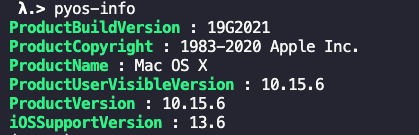
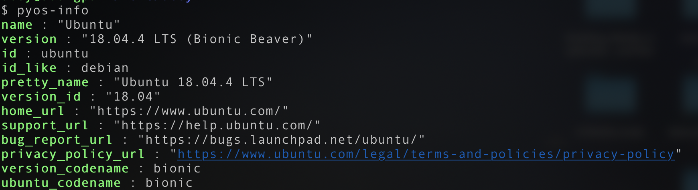

# Installation

```bash
# via pip
$ pip install pyos-info
# via setup.py
$ python setup.py install
```

# Usage

```
$ pyos-info
```

On `macOS`



---

On `Linux`



---

On `Window`

I don't use `Windows` :)